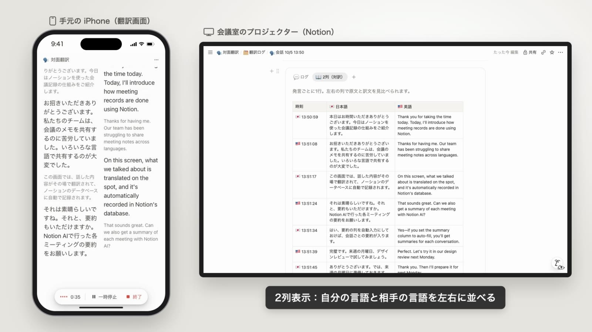
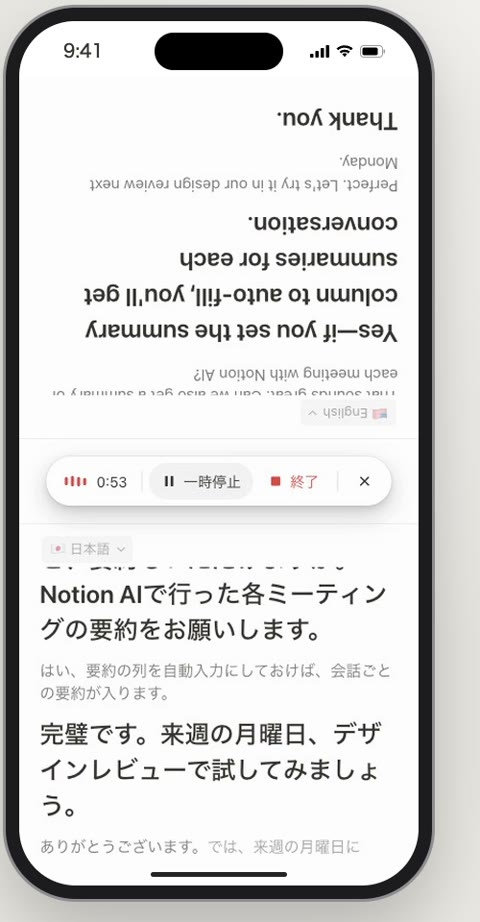
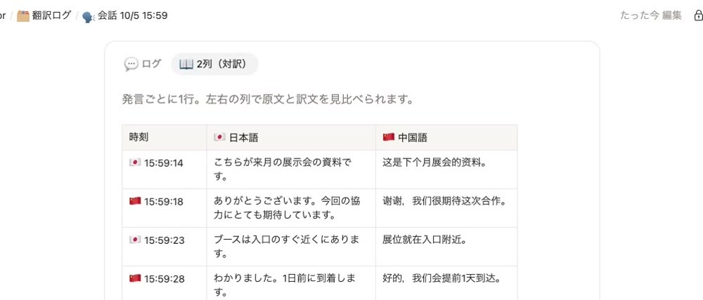

# N-Translator (face-to-face translation for Notion)

[日本語](README.md) | **English**

N-Translator listens to a face-to-face conversation on your iPhone, translates it both ways in real time, and writes the original and the translation into Notion as you speak.
Put the Notion page on the meeting-room projector and everyone can follow the conversation live.



- **Two-way live translation** — the spoken language is detected automatically. Speak Japanese and it is translated into your partner's language, and vice versa
- **60 languages** — Japanese ⇄ English by default. Choose any two of 60 languages, such as Chinese, Korean, Spanish or Vietnamese
- **Logged to Notion automatically** — one row per conversation in a "翻訳ログ" (translation log) database. Each conversation page has a "Log" tab and a "Side-by-side" tab
- **One-tap Notion setup** — creates the guide, a launch button and the log database on your page
- **Three views** — log, two columns, and face-to-face (the top half is upside down for the person across the table)
- **Works on weak networks** — audio is compressed, and recent audio is buffered and resent when the connection drops
- **Custom terms** — register names, company terms and fixed translations. Common Notion and AI terms are built in

<p>
  
  
</p>

> **The app's screens are in Japanese.** This guide gives each Japanese label with its meaning.
> No API keys are included in this repository. Everyone runs it with their own Soniox, Notion and Cloudflare accounts.
> This is a personal project and is not affiliated with Notion, Soniox or Cloudflare.

See [Releases](https://github.com/TK-WFL/n-translator/releases) and [CHANGELOG.md](CHANGELOG.md) for what's new.

---

## Contents

1. [How it works](#how-it-works)
2. [What you need and costs](#what-you-need-and-costs)
3. [Setup (about 20 minutes)](#setup-about-20-minutes)
   1. [Create a Soniox API key](#1-create-a-soniox-api-key)
   2. [Prepare Notion (page and connection)](#2-prepare-notion-page-and-connection)
   3. [Deploy to Cloudflare (one button)](#3-deploy-to-cloudflare-one-button)
   4. [Open it on your iPhone](#4-open-it-on-your-iphone)
   5. [Set up the Notion page (one tap)](#5-set-up-the-notion-page-one-tap)
4. [Usage](#usage)
5. [Settings](#settings)
6. [Troubleshooting](#troubleshooting)
7. [Security and privacy](#security-and-privacy)
8. [Updating to a new version](#updating-to-a-new-version)
9. [For developers](#for-developers)

---

## How it works

```
[Safari on iPhone]  ── audio (compressed) ──→  Soniox (speech recognition + translation)
   translation screen      ←── original + translation ───
      │
      │ each utterance
      ▼
[Your Cloudflare Worker]  ── Notion API ──→  Notion "翻訳ログ" database
   (API keys live only here)                    └→ shown on the projector for everyone
```

- The translation screen is a web page hosted on your own Cloudflare account (free plan). Open it in Safari on your iPhone
- Audio goes straight from the iPhone to Soniox, so there is almost no delay. Your real Soniox API key never reaches the browser — the Worker issues a single-use temporary key valid for 60 seconds
- The Worker writes to Notion on your behalf

## What you need and costs

| | Used for | Cost (as of October 2026 — check each official site) |
|---|---|---|
| [Soniox](https://soniox.com) | Speech recognition and translation | Pay as you go. Real-time recognition is about $0.12/hour, translation included. Requires a credit card |
| [Notion](https://www.notion.so) | Logging | Free plan works. Creating a connection (integration) requires the workspace owner role. Notion AI is needed only if you want the summary column filled automatically |
| [Cloudflare](https://dash.cloudflare.com/sign-up) | Hosts the translation screen and the relay server | Free plan works (100,000 requests/day) |
| [GitHub](https://github.com/signup) | Used when deploying to Cloudflare | Free |
| iPhone (Safari) | Recording and display | Chrome on Mac or Android also works |

Translation pauses automatically after 5 minutes of silence, so a forgotten session won't keep running up Soniox charges.

## Setup (about 20 minutes)

### 1. Create a Soniox API key

1. Create an account at [Soniox Console](https://console.soniox.com)
2. Add a payment method (credit card)
3. Under "API Keys", create a new key and copy it somewhere safe

### 2. Prepare Notion (page and connection)

To use the Notion API you create an **internal connection** (formerly called an "integration") and add it only to the page used for logging.

#### 2-1. Create a page for the logs

Create one empty page in Notion. Any name works (e.g. "N-Translator"), in your private section or a teamspace.
Its contents (guide, launch button, log database) are created with one tap in [step 5](#5-set-up-the-notion-page-one-tap).

#### 2-2. Create an internal connection

> Only workspace owners can create internal connections. In a team workspace, ask an owner to create it for you.

1. Open Notion's [Developer portal](https://app.notion.com/developers/connections)
2. In the sidebar under **Build**, select **Internal connections**
3. Click **Create a new connection** and create it with:
   - Name: `N-Translator` or similar (you'll search for this name when adding it to the page)
   - Workspace: the workspace that contains your log page
4. Open the connection's **Configuration** tab, set **Capabilities** as below and save

   | Capability | Setting | Why |
   |---|---|---|
   | Read content | On | To find the log database |
   | Update content | On | To update conversation length/count and utterances that continue |
   | Insert content | On | To create conversation rows, utterances and the page contents |
   | Comments / user information | Off is fine | Not used |

5. In the same **Configuration** tab, reveal and copy the **API token** (starts with `ntn_`). Treat it like a password

#### 2-3. Add the connection to your log page

Add the connection from 2-2 to the page from 2-1, in either way:

- **From the Notion page**: page menu "•••" (top right) → **Connections** (「接続」) → **+ Add connection** (「接続を追加」) → search for the connection name (`N-Translator`), select it and confirm
- **From the Developer portal**: the connection's **Content access** tab → **Edit access** → select your log page

Pages under that page (such as conversation pages) are accessible automatically.

> **Add the connection to the log page only.** The app picks the log page automatically: the top-most page the connection can access. If you add it to several pages, set `NOTION_PARENT_PAGE` (see [Settings](#settings)) to the URL of the log page.

<details>
<summary>Using a personal access token (PAT) instead</summary>

A token created under [Personal access tokens](https://www.notion.so/developers/tokens) in the Developer portal (starts with `ntn_`) also works. However, a PAT can access **every page you can see** and expires (up to one year). If you use a PAT, you must set `NOTION_PARENT_PAGE` to the URL of the log page. An internal connection, which can see only the page you share with it, is recommended.

</details>

### 3. Deploy to Cloudflare (one button)

[](https://deploy.workers.cloudflare.com/?url=https://github.com/TK-WFL/n-translator)

1. Click the button above and sign in to Cloudflare (create an account if you don't have one)
2. Allow the GitHub connection when asked. A copy of this repository is created in your GitHub account
3. You can keep the default Worker name (it becomes part of the URL)
4. Enter these three values

   | Name | Value |
   |---|---|
   | `SONIOX_API_KEY` | The Soniox API key from step 1 |
   | `ACCESS_KEY` | A passphrase you choose to open the translation screen (20+ random characters recommended — use a password generator) |
   | `NOTION_TOKEN` | The Notion API token from step 2-2 (starts with `ntn_`) |

5. Click "Deploy". After a minute or two you get a URL like `https://notion-live-translate.<your-subdomain>.workers.dev`

To change or add values later, open the Worker in the Cloudflare dashboard → **Settings** → **Variables and Secrets**.

### 4. Open it on your iPhone

1. Open the URL from step 3 in Safari on your iPhone
2. Enter your `ACCESS_KEY` in the 「アクセスキー」 (access key) field and tap 「登録」 (register). The iPhone remembers it, so you only do this once
3. Use Share → **Add to Home Screen** to open it like an app

### 5. Set up the Notion page (one tap)

On the translation screen, tap "•••" (top right) → 「**Notionページを準備**」 (prepare Notion page). The following are created on your log page, and you can open it with the 「Notion で開く」 (open in Notion) link:

- A short guide
- A 「翻訳をはじめる」 (start translating) button — a Notion embed that opens the translation screen in Safari on iPhone
- The 「翻訳ログ」 (translation log) database — one row per conversation with name, date, length, utterance count, partner and summary

Tapping it again never creates duplicates. If you start talking without it, the log database is still created automatically with your first conversation.

> Notion doesn't allow microphones inside embeds, so the embed is only a launch button.

That's it. Tap 「翻訳を開始」 (start translation), allow the microphone, and start talking.

## Usage

1. Open the translation screen on your iPhone. If your partner doesn't speak English, choose their language on the right side of the 「言語」 (language) row at the top (⇄ swaps them)
2. Tap 「翻訳を開始」 (start translation) and talk. After the first utterance, a row is added to the Notion log and utterances are appended as you speak
3. In a meeting room, put that conversation page on the projector (open it from the 「記録」 (record) link on the translation screen) so everyone can read along
4. Tap 「終了」 (end) when you're done. The number of utterances and the length are recorded

### Views

| View | What it shows |
|---|---|
| 「ログ」 Log | One card per utterance: what was said in large text, its translation in gray. The flag is the spoken language; gray background is you, blue is your partner |
| 「2列」 Two columns | Your language and your partner's language side by side |
| 「対面」 Face-to-face | The screen is split and the top half is upside down for the person across the table. Put the iPhone on the table between you. ✕ in the middle returns to the previous view |

The "•••" menu has text size, 「用語を編集」 (edit terms), 「別の端末を登録」 (register another device), 「Notionページを準備」 (prepare Notion page) and 「音声の送り方」 (how audio is sent).

### Choosing languages

- Left is your language, right is your partner's. The list shows 18 common languages first, then the rest (60 in total)
- In the face-to-face view you can also choose from each column's heading. Your partner's heading shows the language in its own name (中文, 한국어, ...) so they can read it
- Languages can't be changed during a conversation. Change them after 「終了」 (end); they apply to the next conversation

### Terms

Write names or company terms one per line to improve recognition. Write `議事録 = meeting minutes` to fix a translation (applies from the next start or resume). Common Notion and AI terms (Notion, Claude, ChatGPT, generative AI, ...) are built in, and product names stay in Latin letters when translated.

### Registering another device

On a registered device, open "•••" → 「別の端末を登録」 (register another device) → 「リンクをコピー」 (copy link), or 「共有…」 (share) via AirDrop. Open that link in the browser of the new device. You can also just type the access key on the new device.

### What's logged in Notion

- Each conversation page has two tabs: 「💬 ログ」 (log) and 「📖 2列（対訳）」 (side-by-side table)
- If you have Notion AI, set the 「要約」 (summary) column to AI autofill to get a summary of each conversation a few minutes later
- Keep the database name 「翻訳ログ」 (if you rename it, a new database is created). Moving it within the page is fine
- Renaming columns won't break anything, but renamed columns (date, length, count) stop being filled in

### Weak networks

- Audio is sent as Opus 32 kbps (μ-law 128 kbps on browsers without Opus encoding). Check it under "•••" → 「音声の送り方」
- While disconnected, the last 15 seconds of audio are kept and sent after reconnecting. Reconnection is retried for 3 minutes
- If more than 20 seconds of audio piles up unsent, some audio is skipped to stay real-time
- Real-time recognition and translation don't work offline (they run in the cloud)

### Tips for iPhone

- Keep the translation screen open while recording. Switching apps or locking the screen stops recording (an iOS restriction), so translation pauses. Come back and tap 「再開」 (resume) to continue the same conversation
- The screen is kept awake while translating
- If the microphone doesn't work in the Notion app's in-app browser, use Share → "Open in Safari"

## Settings

Add these in Cloudflare → **Settings** → **Variables and Secrets**, as type **Secret**.

| Name | Required | Description |
|---|---|---|
| `SONIOX_API_KEY` | ✓ | Your Soniox API key |
| `ACCESS_KEY` | ✓ | The passphrase to open the translation screen (you choose it) |
| `NOTION_TOKEN` | ✓ | The API token of your Notion internal connection (starts with `ntn_`). Without it, translation still works but nothing is logged to Notion |
| `NOTION_PARENT_PAGE` | | URL of the log page. Set it if the connection has access to several pages, or if you use a PAT |
| `NOTION_DATABASE` | | URL of the log database, if you keep it outside the log page |

## Troubleshooting

| Message / symptom | What to do |
|---|---|
| 「アクセスキーが登録されていません」 (access key not registered) | Enter your `ACCESS_KEY` and tap 「登録」. If you forgot it, set a new `ACCESS_KEY` in Cloudflare |
| 「SONIOX_API_KEY が設定されていません」 or 「Soniox: …」 errors | Check the key in Cloudflare's Variables and Secrets, and your Soniox balance and payment method |
| 「Notion の接続がどのページにも追加されていません」 (the connection isn't added to any page) | Add the connection to your log page: "•••" → Connections → + Add connection ([2-3](#2-3-add-the-connection-to-your-log-page)) |
| 「接続が追加されたページが複数あります」 (the connection is added to several pages) | Keep the connection on the log page only, or set `NOTION_PARENT_PAGE` to the log page URL |
| 「Notion 403」, 「Notion 401」 and similar errors | Check that Read / Update / Insert content are on in the connection's Capabilities, and that `NOTION_TOKEN` is correct (and current, if you regenerated it) |
| 「マイクを使えませんでした」 (couldn't use the microphone) | Allow the microphone for Safari in iPhone Settings. In an in-app browser, reopen in Safari |
| It switches to 「一時停止中」 (paused) by itself | 5 minutes of silence, you left the screen, or the microphone became unavailable. Tap 「再開」 to continue |
| Certain words are misheard | Add them to 「用語」 (terms) |
| Two 「翻訳ログ」 databases appear | Rename the database back to 「翻訳ログ」 and delete the new one |

## Security and privacy

- API keys and tokens are stored only as secrets in your Cloudflare account. They are never in the code or on screen
- The translation screen and API can't be used without `ACCESS_KEY`. Anyone who knows it can use your Soniox and Notion through the app, so don't share it. If it may have leaked, change it in Cloudflare
- Add the Notion connection only to your log page (the app doesn't read anything except its log)
- Audio is processed by Soniox — see [Soniox security and privacy](https://soniox.com/docs/stt/security-and-privacy). Let the people you talk with know that the conversation is processed in the cloud and stored in Notion
- Setting a usage limit in the Soniox dashboard protects you in case a key ever leaks

## Updating to a new version

Pull the latest version into the repository Cloudflare created in your GitHub account in step 3; Cloudflare redeploys automatically.

```bash
git clone https://github.com/<your-account>/<created-repository>.git
cd <created-repository>
git fetch https://github.com/TK-WFL/n-translator.git main
git checkout FETCH_HEAD -- .
git commit -m "Update N-Translator to the latest version"
git push
```

Your API keys and other settings are kept.

## For developers

### Run locally

```bash
cp .dev.vars.example .env   # fill in the values (ACCESS_KEY may be empty)
node server.mjs             # http://localhost:8787
```

To try the screens without API keys, open `http://localhost:8787/?demo` (plays a sample conversation).

### Deploy from the command line

```bash
npx wrangler login
npx wrangler secret put SONIOX_API_KEY
npx wrangler secret put ACCESS_KEY
npx wrangler secret put NOTION_TOKEN
npx wrangler deploy
```

### Tests

```bash
npm test
```

### Files

| File | Role |
|---|---|
| `worker.js` / `wrangler.jsonc` | Cloudflare Workers entry point and config |
| `lib/api.js` | API (access key check, Soniox temporary keys, Notion logging and page setup) |
| `server.mjs` | Local server |
| `public/index.html` / `style.css` | Notion-style UI (only the launch button when embedded) |
| `public/app.js` | Recording → Soniox, views, Notion sync, auto pause |
| `public/codec.js` / `uplink.js` | Audio compression and sending (buffering while disconnected, skipping when backed up) |
| `public/segmenter.js` / `turns.js` | Group Soniox results into utterances and turns |
| `public/languages.js` | The 60 languages and per-language handling |
| `public/context.js` | Built-in terms |
| `public/demo.js` | Sample conversation for `?demo` |
| `test/` | Automated tests |

## License

[MIT](LICENSE)
